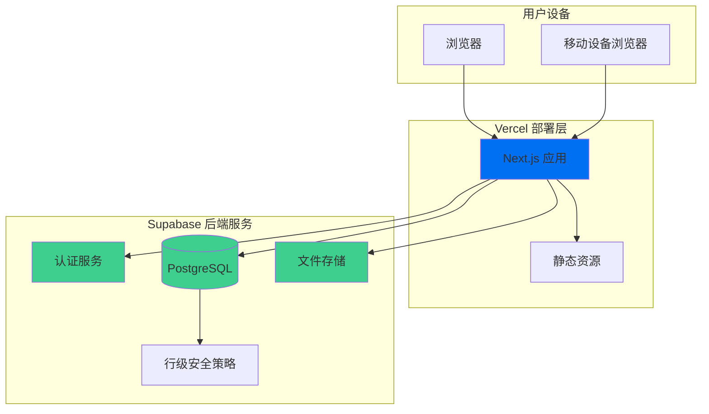
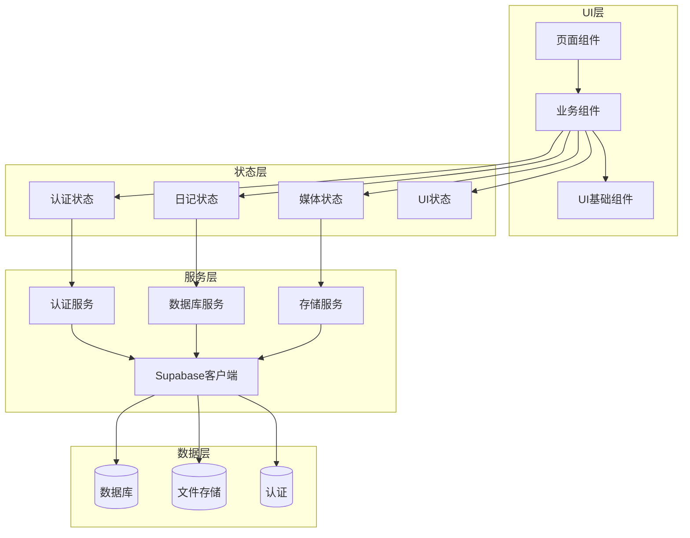
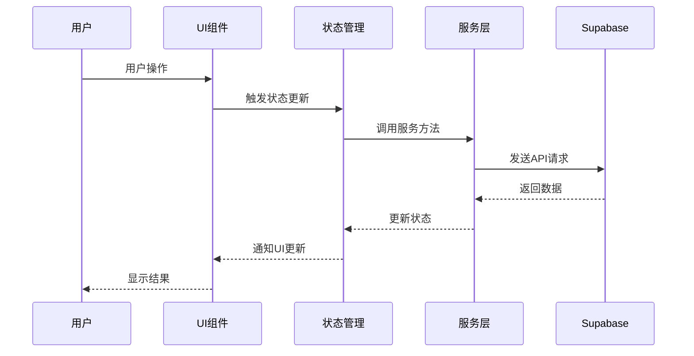

# 拾光集 v1.0 - 设计文档 (DESIGN)

**任务名称:** shi-guang-ji-v1  
**创建日期:** 2025-09-06  
**阶段:** Phase 2 - Architect  
**基于文档:** CONSENSUS_shi-guang-ji-v1.md

---

## 1. 整体架构图



---

## 2. 分层设计和核心组件

### 2.1 前端应用层 (Next.js)

#### 2.1.1 页面层 (Pages)
```
app/
├── (auth)/
│   ├── login/page.tsx          # 登录页面
│   ├── register/page.tsx       # 注册页面
│   └── layout.tsx              # 认证布局
├── (dashboard)/
│   ├── page.tsx                # 首页/仪表板
│   ├── check-in/page.tsx       # 打卡页面
│   ├── diary/
│   │   ├── page.tsx            # 日记列表
│   │   ├── new/page.tsx        # 新建日记
│   │   └── [id]/page.tsx       # 日记详情/编辑
│   ├── media/page.tsx          # 媒体库
│   ├── profile/page.tsx        # 个人资料
│   └── layout.tsx              # 主应用布局
├── api/                        # API路由 (如需要)
├── globals.css                 # 全局样式
└── layout.tsx                  # 根布局
```

#### 2.1.2 组件层 (Components)
```
components/
├── ui/                         # Shadcn/ui 基础组件
│   ├── button.tsx
│   ├── input.tsx
│   ├── card.tsx
│   └── ...
├── layout/
│   ├── Header.tsx              # 顶部导航
│   ├── Sidebar.tsx             # 侧边栏
│   └── Footer.tsx              # 底部
├── auth/
│   ├── LoginForm.tsx           # 登录表单
│   ├── RegisterForm.tsx        # 注册表单
│   └── ProfileForm.tsx         # 资料编辑表单
├── check-in/
│   ├── CheckInButton.tsx       # 打卡按钮
│   ├── MoodSelector.tsx        # 心情选择器
│   └── CheckInCalendar.tsx     # 打卡日历
├── diary/
│   ├── DiaryEditor.tsx         # 日记编辑器
│   ├── DiaryList.tsx           # 日记列表
│   └── DiaryCard.tsx           # 日记卡片
├── media/
│   ├── MediaUpload.tsx         # 文件上传
│   ├── MediaGrid.tsx           # 网格视图
│   ├── MediaTimeline.tsx       # 时间线视图
│   └── MediaPreview.tsx        # 预览组件
└── common/
    ├── Loading.tsx             # 加载组件
    ├── ErrorBoundary.tsx       # 错误边界
    └── ConfirmDialog.tsx       # 确认对话框
```

#### 2.1.3 状态管理层 (Zustand)
```
stores/
├── authStore.ts                # 用户认证状态
├── diaryStore.ts               # 日记相关状态
├── mediaStore.ts               # 媒体库状态
└── uiStore.ts                  # UI状态 (主题、加载等)
```

### 2.2 数据服务层 (Supabase)

#### 2.2.1 数据库表结构
```sql
-- 用户资料表
CREATE TABLE profiles (
    id UUID PRIMARY KEY REFERENCES auth.users(id),
    username VARCHAR(50),
    avatar_url TEXT,
    bio TEXT,
    created_at TIMESTAMP WITH TIME ZONE DEFAULT NOW(),
    updated_at TIMESTAMP WITH TIME ZONE DEFAULT NOW()
);

-- 每日打卡表
CREATE TABLE check_ins (
    id BIGSERIAL PRIMARY KEY,
    user_id UUID REFERENCES auth.users(id),
    mood VARCHAR(20) NOT NULL,
    note TEXT,
    created_at DATE DEFAULT CURRENT_DATE,
    UNIQUE(user_id, created_at)
);

-- 日记表
CREATE TABLE diaries (
    id BIGSERIAL PRIMARY KEY,
    user_id UUID REFERENCES auth.users(id),
    title TEXT NOT NULL,
    content TEXT NOT NULL,
    created_at TIMESTAMP WITH TIME ZONE DEFAULT NOW(),
    updated_at TIMESTAMP WITH TIME ZONE DEFAULT NOW()
);

-- 媒体文件表
CREATE TABLE media (
    id BIGSERIAL PRIMARY KEY,
    user_id UUID REFERENCES auth.users(id),
    file_path TEXT NOT NULL,
    file_type VARCHAR(10) NOT NULL,
    file_size BIGINT,
    created_at TIMESTAMP WITH TIME ZONE DEFAULT NOW()
);

-- 标签表
CREATE TABLE tags (
    id BIGSERIAL PRIMARY KEY,
    name VARCHAR(50) UNIQUE NOT NULL
);

-- 日记标签关联表
CREATE TABLE diary_tags (
    diary_id BIGINT REFERENCES diaries(id) ON DELETE CASCADE,
    tag_id BIGINT REFERENCES tags(id) ON DELETE CASCADE,
    PRIMARY KEY (diary_id, tag_id)
);
```

#### 2.2.2 RLS 安全策略
```sql
-- 启用RLS
ALTER TABLE profiles ENABLE ROW LEVEL SECURITY;
ALTER TABLE check_ins ENABLE ROW LEVEL SECURITY;
ALTER TABLE diaries ENABLE ROW LEVEL SECURITY;
ALTER TABLE media ENABLE ROW LEVEL SECURITY;

-- 用户只能访问自己的数据
CREATE POLICY "Users can view own profile" ON profiles
    FOR SELECT USING (auth.uid() = id);

CREATE POLICY "Users can update own profile" ON profiles
    FOR UPDATE USING (auth.uid() = id);

CREATE POLICY "Users can view own check-ins" ON check_ins
    FOR ALL USING (auth.uid() = user_id);

CREATE POLICY "Users can manage own diaries" ON diaries
    FOR ALL USING (auth.uid() = user_id);

CREATE POLICY "Users can manage own media" ON media
    FOR ALL USING (auth.uid() = user_id);
```

---

## 3. 模块依赖关系图



---

## 4. 接口契约定义

### 4.1 认证接口
```typescript
interface AuthService {
  signUp(email: string, password: string): Promise<AuthResponse>
  signIn(email: string, password: string): Promise<AuthResponse>
  signOut(): Promise<void>
  getCurrentUser(): Promise<User | null>
  updateProfile(profile: ProfileUpdate): Promise<Profile>
}

interface Profile {
  id: string
  username: string
  avatar_url?: string
  bio?: string
  created_at: string
  updated_at: string
}
```

### 4.2 打卡接口
```typescript
interface CheckInService {
  createCheckIn(data: CheckInCreate): Promise<CheckIn>
  getCheckIns(userId: string, year?: number, month?: number): Promise<CheckIn[]>
  getTodayCheckIn(userId: string): Promise<CheckIn | null>
}

interface CheckIn {
  id: number
  user_id: string
  mood: string
  note?: string
  created_at: string
}
```

### 4.3 日记接口
```typescript
interface DiaryService {
  createDiary(data: DiaryCreate): Promise<Diary>
  updateDiary(id: number, data: DiaryUpdate): Promise<Diary>
  deleteDiary(id: number): Promise<void>
  getDiaries(userId: string, page?: number, limit?: number): Promise<Diary[]>
  getDiary(id: number): Promise<Diary>
}

interface Diary {
  id: number
  user_id: string
  title: string
  content: string
  created_at: string
  updated_at: string
}
```

### 4.4 媒体接口
```typescript
interface MediaService {
  uploadFile(file: File): Promise<MediaFile>
  getMediaFiles(userId: string, type?: 'image' | 'video'): Promise<MediaFile[]>
  deleteFile(id: number): Promise<void>
  getSignedUrl(path: string): Promise<string>
}

interface MediaFile {
  id: number
  user_id: string
  file_path: string
  file_type: 'image' | 'video'
  file_size: number
  created_at: string
}
```

---

## 5. 数据流向图



---

## 6. 异常处理策略

### 6.1 错误分类
- **网络错误:** 连接失败、超时
- **认证错误:** 未登录、权限不足
- **业务错误:** 数据验证失败、业务规则违反
- **系统错误:** 服务器内部错误

### 6.2 处理策略
```typescript
interface ErrorHandler {
  handleNetworkError(error: NetworkError): void
  handleAuthError(error: AuthError): void
  handleBusinessError(error: BusinessError): void
  handleSystemError(error: SystemError): void
}

// 全局错误处理
const globalErrorHandler = {
  network: (error) => showToast('网络连接失败，请检查网络'),
  auth: (error) => redirectToLogin(),
  business: (error) => showToast(error.message),
  system: (error) => showToast('系统错误，请稍后重试')
}
```

---

## 7. 性能优化策略

### 7.1 前端优化
- **代码分割:** 按路由和组件进行代码分割
- **图片优化:** Next.js Image组件，WebP格式，懒加载
- **缓存策略:** SWR/React Query进行数据缓存
- **Bundle优化:** Tree shaking，压缩，CDN

### 7.2 数据库优化
- **索引策略:** 为查询字段添加适当索引
- **分页查询:** 避免一次性加载大量数据
- **连接池:** Supabase自动管理连接池

---

## 8. 安全设计

### 8.1 认证安全
- JWT Token自动刷新
- 安全的密码策略
- 会话超时管理

### 8.2 数据安全
- 行级安全策略 (RLS)
- 输入验证和清理
- SQL注入防护

### 8.3 文件安全
- 文件类型验证
- 大小限制
- 私有存储桶
- 签名URL访问

---

**设计确认:** 本设计文档提供了完整的系统架构、组件设计和接口规范，可以进入下一阶段的任务分解。
