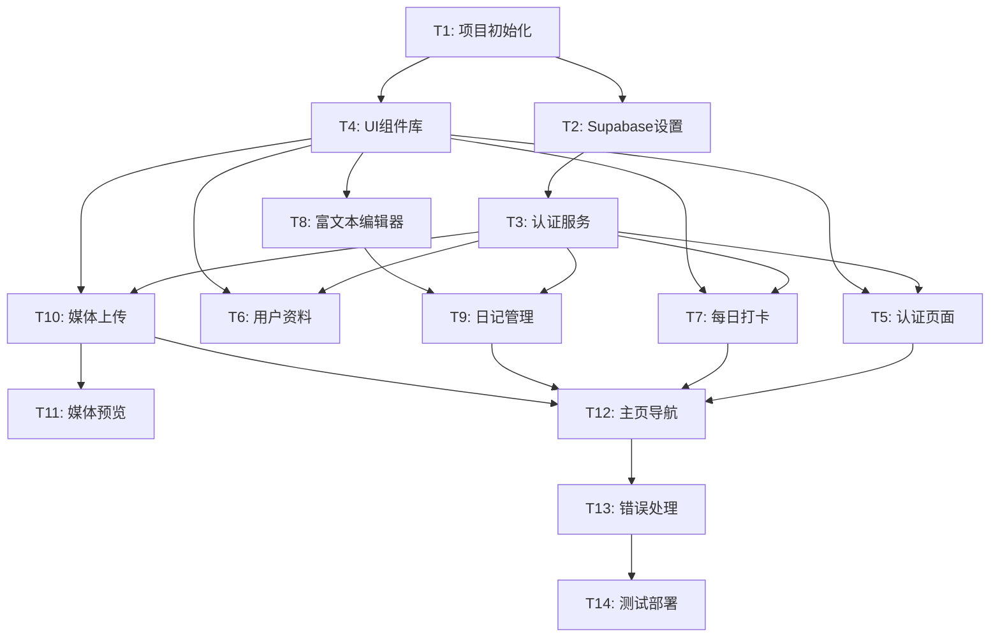

# 拾光集 v1.0 - 任务分解文档 (TASK)

**任务名称:** shi-guang-ji-v1  
**创建日期:** 2025-09-06  
**阶段:** Phase 3 - Atomize  
**基于文档:** DESIGN_shi-guang-ji-v1.md

---

## 1. 任务分解概述

基于设计文档，将项目分解为以下原子任务，每个任务都有明确的输入契约、输出契约和验收标准。

---

## 2. 原子任务列表

### T1: 项目初始化和基础配置
**复杂度:** 低  
**预估时间:** 30分钟

**输入契约:**
- 项目需求文档
- 技术架构文档
- 开发环境 (Node.js, pnpm)

**输出契约:**
- Next.js 14项目脚手架
- TypeScript配置
- ESLint/Prettier配置
- Tailwind CSS配置
- 基础目录结构

**实现约束:**
- 使用 `create-next-app` 初始化
- 启用TypeScript严格模式
- 配置Shadcn/ui
- 设置代码规范工具

**验收标准:**
- [ ] 项目可以成功启动 (`pnpm dev`)
- [ ] TypeScript编译无错误
- [ ] ESLint检查通过
- [ ] 基础页面可以访问

---

### T2: Supabase项目设置和数据库初始化
**复杂度:** 中  
**预估时间:** 45分钟

**输入契约:**
- Supabase账户
- 数据库设计文档
- RLS策略定义

**输出契约:**
- Supabase项目创建
- 数据库表结构
- RLS策略配置
- 环境变量配置

**实现约束:**
- 使用Supabase免费层
- 严格按照设计文档创建表结构
- 为所有表启用RLS
- 敏感信息使用环境变量

**验收标准:**
- [ ] 数据库表创建成功
- [ ] RLS策略正确配置
- [ ] 可以通过Supabase客户端连接
- [ ] 环境变量正确配置

**依赖关系:** 依赖 T1

---

### T3: Supabase客户端集成和认证服务
**复杂度:** 中  
**预估时间:** 60分钟

**输入契约:**
- Supabase项目配置
- 认证接口设计
- Next.js项目结构

**输出契约:**
- Supabase客户端配置
- 认证服务实现
- 认证状态管理 (Zustand)
- 认证中间件

**实现约束:**
- 使用 `@supabase/supabase-js`
- 实现JWT自动刷新
- 提供类型安全的接口
- 集成Next.js中间件

**验收标准:**
- [ ] 用户可以注册账户
- [ ] 用户可以登录/登出
- [ ] 认证状态正确管理
- [ ] 受保护路由正常工作

**依赖关系:** 依赖 T2

---

### T4: UI基础组件库设置
**复杂度:** 低  
**预估时间:** 45分钟

**输入契约:**
- Shadcn/ui组件库
- 设计系统规范
- Tailwind CSS配置

**输出契约:**
- 基础UI组件 (Button, Input, Card等)
- 布局组件 (Header, Sidebar, Footer)
- 主题配置
- 响应式设计基础

**实现约束:**
- 使用Shadcn/ui组件
- 遵循设计系统规范
- 确保移动端适配
- 支持暗色主题 (可选)

**验收标准:**
- [ ] 基础组件正常渲染
- [ ] 响应式布局正确
- [ ] 组件样式符合设计
- [ ] TypeScript类型完整

**依赖关系:** 依赖 T1

---

### T5: 用户认证页面实现
**复杂度:** 中  
**预估时间:** 90分钟

**输入契约:**
- 认证服务接口
- UI组件库
- 页面设计规范

**输出契约:**
- 登录页面
- 注册页面
- 密码重置页面
- 表单验证逻辑

**实现约束:**
- 使用React Hook Form
- 实现客户端验证
- 提供友好的错误提示
- 支持键盘导航

**验收标准:**
- [ ] 用户可以通过表单注册
- [ ] 用户可以通过表单登录
- [ ] 表单验证正确工作
- [ ] 错误处理友好

**依赖关系:** 依赖 T3, T4

---

### T6: 用户资料管理功能
**复杂度:** 中  
**预估时间:** 75分钟

**输入契约:**
- 用户认证状态
- 文件上传服务
- 资料表结构

**输出契约:**
- 个人资料页面
- 头像上传功能
- 资料编辑表单
- 数据更新服务

**实现约束:**
- 支持头像图片上传
- 实现表单数据验证
- 提供实时预览
- 优化图片处理

**验收标准:**
- [ ] 用户可以查看个人资料
- [ ] 用户可以编辑个人信息
- [ ] 头像上传功能正常
- [ ] 数据更新及时同步

**依赖关系:** 依赖 T3, T4

---

### T7: 每日打卡功能实现
**复杂度:** 中  
**预估时间:** 90分钟

**输入契约:**
- 打卡数据表结构
- 心情标签定义
- 日历组件需求

**输出契约:**
- 打卡按钮组件
- 心情选择器
- 打卡历史日历
- 打卡数据服务

**实现约束:**
- 每天只能打卡一次
- 支持心情标签选择
- 提供历史记录查看
- 实现日历视图

**验收标准:**
- [ ] 用户可以完成每日打卡
- [ ] 心情选择器正常工作
- [ ] 打卡历史正确显示
- [ ] 重复打卡限制有效

**依赖关系:** 依赖 T3, T4

---

### T8: 富文本日记编辑器
**复杂度:** 高  
**预估时间:** 120分钟

**输入契约:**
- TipTap编辑器库
- Markdown支持需求
- 媒体插入功能

**输出契约:**
- 富文本编辑器组件
- Markdown双向绑定
- 图片/视频插入
- 自动保存功能

**实现约束:**
- 使用TipTap编辑器
- 支持基础Markdown语法
- 实现媒体文件插入
- 30秒自动保存草稿

**验收标准:**
- [ ] 编辑器正常工作
- [ ] Markdown语法支持
- [ ] 媒体插入功能正常
- [ ] 自动保存正确工作

**依赖关系:** 依赖 T4

---

### T9: 日记管理功能
**复杂度:** 中  
**预估时间:** 90分钟

**输入契约:**
- 日记编辑器组件
- 日记数据服务
- 列表展示需求

**输出契约:**
- 日记列表页面
- 日记详情页面
- 新建/编辑日记页面
- 日记CRUD服务

**实现约束:**
- 支持分页加载
- 提供搜索功能
- 实现删除确认
- 优化加载性能

**验收标准:**
- [ ] 用户可以创建新日记
- [ ] 用户可以编辑现有日记
- [ ] 用户可以删除日记
- [ ] 日记列表正确显示

**依赖关系:** 依赖 T8, T3

---

### T10: 媒体库上传和管理
**复杂度:** 高  
**预估时间:** 120分钟

**输入契约:**
- Supabase Storage配置
- 文件上传需求
- 媒体展示规范

**输出契约:**
- 文件上传组件
- 媒体网格视图
- 媒体时间线视图
- 文件管理服务

**实现约束:**
- 支持批量上传
- 实现上传进度显示
- 提供文件类型验证
- 优化大文件处理

**验收标准:**
- [ ] 用户可以上传图片/视频
- [ ] 媒体文件正确显示
- [ ] 支持不同视图模式
- [ ] 文件删除功能正常

**依赖关系:** 依赖 T3, T4

---

### T11: 媒体预览和详情功能
**复杂度:** 中  
**预估时间:** 75分钟

**输入契约:**
- 媒体文件数据
- 全屏预览需求
- EXIF信息显示

**输出契约:**
- 媒体预览组件
- 全屏查看功能
- EXIF信息显示
- 预览导航功能

**实现约束:**
- 支持图片/视频预览
- 实现全屏模式
- 提供基础EXIF信息
- 优化加载性能

**验收标准:**
- [ ] 媒体文件可以预览
- [ ] 全屏模式正常工作
- [ ] EXIF信息正确显示
- [ ] 预览导航流畅

**依赖关系:** 依赖 T10

---

### T12: 应用主页和导航
**复杂度:** 中  
**预估时间:** 60分钟

**输入契约:**
- 各功能模块组件
- 导航设计规范
- 响应式布局需求

**输出契约:**
- 应用主页
- 导航菜单
- 面包屑导航
- 移动端菜单

**实现约束:**
- 实现响应式导航
- 提供快捷操作入口
- 优化移动端体验
- 支持键盘导航

**验收标准:**
- [ ] 主页正确显示各模块
- [ ] 导航菜单正常工作
- [ ] 移动端适配良好
- [ ] 用户体验流畅

**依赖关系:** 依赖 T5, T7, T9, T10

---

### T13: 错误处理和加载状态
**复杂度:** 中  
**预估时间:** 60分钟

**输入契约:**
- 全局错误处理策略
- 加载状态设计
- 用户反馈需求

**输出契约:**
- 错误边界组件
- 加载状态组件
- Toast通知系统
- 全局错误处理

**实现约束:**
- 实现优雅的错误处理
- 提供有意义的错误信息
- 优化加载体验
- 支持离线状态提示

**验收标准:**
- [ ] 错误能够优雅处理
- [ ] 加载状态清晰显示
- [ ] 用户反馈及时
- [ ] 系统稳定性良好

**依赖关系:** 依赖所有功能模块

---

### T14: 测试和部署配置
**复杂度:** 中  
**预估时间:** 90分钟

**输入契约:**
- 完整的应用功能
- Vercel部署需求
- 测试覆盖要求

**输出契约:**
- 单元测试套件
- 集成测试
- Vercel部署配置
- CI/CD流程

**实现约束:**
- 使用Jest和Testing Library
- 覆盖关键功能
- 配置自动部署
- 设置环境变量

**验收标准:**
- [ ] 关键功能有测试覆盖
- [ ] 应用可以成功部署
- [ ] CI/CD流程正常工作
- [ ] 生产环境稳定运行

**依赖关系:** 依赖所有功能模块

---

## 3. 任务依赖关系图

---

## 4. 执行顺序建议

**第一阶段 (基础设施):**
1. T1: 项目初始化
2. T2: Supabase设置
3. T3: 认证服务
4. T4: UI组件库

**第二阶段 (核心功能):**
5. T5: 认证页面
6. T6: 用户资料
7. T7: 每日打卡
8. T8: 富文本编辑器

**第三阶段 (高级功能):**
9. T9: 日记管理
10. T10: 媒体上传
11. T11: 媒体预览

**第四阶段 (集成完善):**
12. T12: 主页导航
13. T13: 错误处理
14. T14: 测试部署

---

**任务分解确认:** 所有任务都有明确的输入输出契约和验收标准，可以进入审批阶段。
